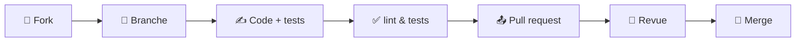

# 🤝 Contribuer à Open3CL

Merci de l'intérêt que vous portez au projet ! Open3CL est un moteur de calcul réglementaire : chaque correction, même
d'un dixième de pourcent sur une déperdition, rapproche la librairie des logiciels certifiés. **Toutes les
contributions comptent.**

> Retour au [README](README.md)

---

## Sommaire

- [Comment contribuer](#comment-contribuer)
- [Mettre en place son environnement](#mettre-en-place-son-environnement)
- [Comprendre le projet](#comprendre-le-projet)
- [Le cycle d'une contribution](#le-cycle-dune-contribution)
- [Conventions de commit](#conventions-de-commit)
- [Règles de code](#règles-de-code)
- [Tests](#tests)
- [Corriger un écart de calcul, pas à pas](#corriger-un-écart-de-calcul-pas-à-pas)
- [Signaler un bug](#signaler-un-bug)
- [Proposer une fonctionnalité](#proposer-une-fonctionnalité)
- [Questions](#questions)

---

## Comment contribuer

Il n'y a pas que le code.

| Vous pouvez…                       | Comment                                                                                                                           |
| :--------------------------------- | :-------------------------------------------------------------------------------------------------------------------------------- |
| 🐛 **Signaler un écart**           | [Ouvrir un bug](https://github.com/Open3CL/engine/issues/new?labels=bug&template=bug-report---.md) avec le numéro du DPE concerné |
| 🔬 **Documenter un cas limite**    | Un DPE réel qui met le moteur en défaut est une contribution à part entière                                                       |
| 🧪 **Ajouter des tests**           | Chaque article de la méthode mérite ses tests unitaires                                                                           |
| 📖 **Améliorer la documentation**  | Une explication qui vous a manqué manquera à d'autres                                                                             |
| 🛠️ **Corriger un calcul**          | Voir [Corriger un écart de calcul](#corriger-un-écart-de-calcul-pas-à-pas)                                                        |
| ✨ **Proposer une fonctionnalité** | [Ouvrir une feature](https://github.com/Open3CL/engine/issues/new?labels=enhancement&template=feature-request---.md)              |

---

## Mettre en place son environnement

### Pré-requis

| Outil       | Version | Vérifier         |
| :---------- | :------ | :--------------- |
| **Node.js** | ≥ 20    | `node --version` |
| **npm**     | ≥ 10    | `npm --version`  |
| **git**     | —       | `git --version`  |

### Installation

```sh
git clone https://github.com/Open3CL/engine.git
cd engine
npm ci
```

`npm ci` installe également les hooks [husky](https://typicode.github.io/husky/) : le formatage des fichiers modifiés et
la validation du message de commit sont automatiques.

### Les commandes utiles

| Commande                  | Ce qu'elle fait                                          |
| :------------------------ | :------------------------------------------------------- |
| `npm run test:unit`       | Tests unitaires (`src/**/*.spec.js`)                     |
| `npm run test:unit:ci`    | Idem, avec le rapport de couverture et le seuil de 100 % |
| `npm run test:int`        | Tests d'intégration sur DPE réels (`test/**/*.spec.js`)  |
| `npm test`                | Toute la suite                                           |
| `npm run test:corpus`     | Tests de corpus — voir [docs/CORPUS.md](docs/CORPUS.md)  |
| `npm run qa:lint`         | ESLint                                                   |
| `npm run qa:lint:fix`     | ESLint avec correction automatique                       |
| `npm run qa:format`       | Prettier sur tout le projet                              |
| `npm run qa:duplication`  | Détection de code dupliqué (jscpd)                       |
| `npm run reports:preview` | Ouvre le rapport de corpus dans le navigateur            |

> [!IMPORTANT]
> Avant d'ouvrir une pull request, exécutez au minimum `npm run qa:lint` et `npm run test:unit`.

### Tests d'intégration et variables d'environnement

Les tests d'intégration téléchargent des DPE depuis l'API de l'ADEME lorsqu'ils ne sont pas déjà présents dans
`test/fixtures/`. Il faut alors :

```sh
export ADEME_CLIENT_ID=...
export ADEME_CLIENT_SECRET=...
```

Les DPE déjà présents dans `test/fixtures/` ne sont jamais retéléchargés : la plupart des tests fonctionnent donc sans
identifiants.

---

## Comprendre le projet

### Arborescence

```text
engine/
├── index.js              Point d'entrée public de la librairie
├── src/
│   ├── engine.js         Orchestrateur : enchaîne tous les modules de calcul
│   ├── 3_deperdition.js  ─┐
│   ├── 9_chauffage.js     │ Un module par article de la méthode 3CL-DPE 2021,
│   ├── 11_ecs.js          │ le préfixe numérique reprenant la numérotation
│   ├── 15_conso_aux.js   ─┘ de l'annexe 1 de l'arrêté
│   ├── conso.js          Agrégation des consommations, coûts, émissions
│   ├── tv.js             Tables de valeurs réglementaires
│   ├── enums.js          Énumérations de l'ADEME
│   └── *.spec.js         Tests unitaires, au plus près du code testé
├── test/
│   ├── fixtures/         DPE réels utilisés par les tests d'intégration
│   ├── corpus/           Runner des tests de corpus
│   └── *.spec.js         Tests d'intégration
├── docs/                 Documentation détaillée
└── dist/reports/corpus/  Rapports générés (JSON, CSV, tableau de bord HTML)
```

### Le principe directeur

Le moteur **reproduit la méthode réglementaire, article par article**. Quand vous modifiez un calcul :

1. **Citez la source.** Un commentaire renvoyant à la section de
   [l'annexe 1 de l'arrêté du 31 mars 2021](https://rt-re-batiment.developpement-durable.gouv.fr/IMG/pdf/consolide_annexe_1_arrete_du_31_03_2021_relatif_aux_methodes_et_procedures_applicables.pdf)
   vaut mieux qu'une longue explication.
2. **Nommez comme la méthode.** Si l'arrêté parle de `Pcirb,j`, la variable s'appelle `Pcirb_j`, pas `pumpPower`.
3. **Mesurez sur le corpus.** Un calcul « plus juste » qui fait chuter le taux de réussite doit être discuté : c'est
   souvent le signe que les logiciels certifiés font autrement.

---

## Le cycle d'une contribution



1. **Forkez** le dépôt et clonez votre fork.
2. **Créez une branche** depuis `main`, nommée d'après ce qu'elle fait :
   `fix/issue-123-deperdition-mur`, `feat/photovoltaique`, `docs/corpus`.
3. **Codez**, en ajoutant les tests correspondants.
4. **Vérifiez** : `npm run qa:lint && npm run test:unit`.
5. **Commitez** en respectant les [conventions](#conventions-de-commit).
6. **Ouvrez une pull request** vers `main`, avec :
   - une description de ce qui change et **pourquoi** ;
   - le numéro de l'issue liée (`Closes #123`) ;
   - **l'impact sur les corpus** si vous avez modifié un calcul (avant / après).
7. **Répondez à la revue.** Les mainteneurs sont là pour aider, pas pour juger.

> [!TIP]
> Pour une modification importante, ouvrez d'abord une issue pour en discuter. Cela évite d'écrire du code qui ne sera
> pas retenu.

---

## Conventions de commit

Les messages suivent la convention [Conventional Commits](https://www.conventionalcommits.org/fr/), vérifiée
automatiquement par [commitlint](https://commitlint.js.org/).

```text
<type>(<scope>): <sujet>
```

| Type       | Quand l'utiliser                               | Effet sur la version |
| :--------- | :--------------------------------------------- | :------------------- |
| `feat`     | Nouvelle fonctionnalité                        | `minor`              |
| `fix`      | Correction de bug                              | `patch`              |
| `perf`     | Amélioration de performance                    | `patch`              |
| `refactor` | Réorganisation sans changement de comportement | —                    |
| `test`     | Ajout ou modification de tests                 | —                    |
| `docs`     | Documentation                                  | —                    |
| `chore`    | Outillage, dépendances, CI                     | —                    |
| `style`    | Formatage uniquement                           | —                    |

Le sujet doit être en **minuscules** ou en **début de phrase**, sans point final.

```sh
# ✅ Bien
git commit -m "fix(fix-311): Proration des besoins de chauffage pour installations multiples"
git commit -m "feat: support du photovoltaïque en autoconsommation"
git commit -m "test(15_conso_aux): couverture des auxiliaires de distribution ECS"

# ❌ À éviter
git commit -m "correction bug"
git commit -m "WIP"
```

> [!NOTE]
> Les versions sont publiées automatiquement par [semantic-release](https://semantic-release.gitbook.io/) à partir des
> messages de commit. Un `fix:` déclenche une version corrective, un `feat:` une version mineure. **Ne modifiez jamais
> la version dans `package.json` à la main.**

Pensez à [squasher](https://help.github.com/articles/about-git-rebase/) les commits intermédiaires pour garder un
historique lisible.

---

## Règles de code

| Règle                                                                                 | Vérifiée par                            |
| :------------------------------------------------------------------------------------ | :-------------------------------------- |
| Style [JavaScript Standard](https://standardjs.com/), configuré dans `.eslintrc.json` | `npm run qa:lint`                       |
| Formatage Prettier (`.prettierrc`)                                                    | `npm run qa:format`, hook de pre-commit |
| Indentation et fins de ligne selon [`.editorconfig`](http://editorconfig.org/)        | votre éditeur                           |
| Pas de duplication excessive (`.jscpd.json`)                                          | `npm run qa:duplication`                |
| **Toute correction ou fonctionnalité est couverte par au moins un test**              | la revue                                |
| Couverture unitaire à **100 %** (statements, branches, functions, lines)              | `npm run test:unit:ci`                  |

### Style attendu

- **ESM uniquement** (`import` / `export`), le projet est en `"type": "module"`.
- **JSDoc** sur les fonctions exportées : décrivez les paramètres avec leur unité physique.

  ```javascript
  /**
   * 15.2.3 Consommation des auxiliaires de distribution d'ECS
   * @param Sh_logement {number} surface habitable du logement (m²)
   * @param nadeq {number} nombre d'unités d'équivalence
   */
  ```

- **Commentaires en français**, comme le reste du projet et comme la méthode qu'il implémente.
- **Pas de magie** : une constante réglementaire porte un nom et un commentaire renvoyant à la méthode.

---

## Tests

### La pyramide du projet

| Niveau          | Où               | Ce qu'il garantit                                           | Dépendances    |
| :-------------- | :--------------- | :---------------------------------------------------------- | :------------- |
| **Unitaire**    | `src/*.spec.js`  | Chaque article de la méthode, branche par branche           | Toutes mockées |
| **Intégration** | `test/*.spec.js` | Le moteur complet sur un DPE réel, comparé au DPE publié    | DPE en fixture |
| **Corpus**      | `test/corpus/`   | Le moteur sur ~90 000 DPE réels, avec un taux de conformité | API ADEME      |

### Écrire un bon test unitaire

Les tests unitaires mockent toutes les dépendances pour piloter chaque branche :

```javascript
vi.mock('./utils.js', () => ({
  mois_liste: ['Janvier'],
  Njj: { Janvier: 31 }
}));
```

Privilégiez les **valeurs attendues calculables à la main** plutôt que des constantes opaques :

```javascript
// ✅ On comprend d'où vient la valeur
const CONSO_PLANCHER_20W = (31 * 24 * 20) / 1000; // circulateur à 20 W, toutes les heures du mois
expect(di.conso_auxiliaire_distribution_ecs).toBeCloseTo(CONSO_PLANCHER_20W, 10);

// 🟡 Acceptable en régression, mais commentez l'origine du nombre
expect(di.conso_auxiliaire_distribution_ch).toBeCloseTo(215.1781621610199, 9);
```

### Ajouter un DPE de test

```javascript
import { getAdemeFileJsonOrDownload } from './test-helpers.js';

const input = await getAdemeFileJsonOrDownload('2263E1261479X');
const output = calcul_3cl(structuredClone(input));
```

Le DPE est téléchargé une fois puis mis en cache dans `test/fixtures/`. **Commitez le fichier XML** : les autres
contributeurs n'auront pas besoin d'identifiants ADEME.

---

## Corriger un écart de calcul, pas à pas

C'est le type de contribution le plus fréquent. Voici la méthode qui fonctionne.

### 1. Identifier un DPE représentatif

Dans le [rapport de corpus](https://open3cl.github.io/engine/reports/corpus), survolez un DPE au-dessus du seuil : le
détail des propriétés en écart s'affiche, avec la valeur attendue, la valeur calculée et l'écart.

### 2. Remonter à la cause

Le CSV détaillé donne, pour chaque grandeur, `_input` (le DPE publié), `_output` (Open3CL) et `_diff` (l'écart en %) :

```sh
grep "^2263E1261479X," dist/reports/corpus/corpus_dpe.csv/corpus_detailed_report_main.csv
```

Lisez les écarts **dans l'ordre de la chaîne de calcul** — enveloppe, besoins, systèmes, consommations. Le premier
écart significatif est presque toujours la cause des suivants.

### 3. Vérifier l'hypothèse hors du moteur

Avant de modifier le code, reproduisez le calcul attendu dans un petit script : c'est plus rapide, et cela prouve
l'hypothèse. Vérifiez-la ensuite sur **plusieurs DPE** partageant la même configuration — une hypothèse qui ne tient que
sur un cas n'en est pas une.

### 4. Corriger, avec un test unitaire

Le test doit échouer avant la correction et passer après. Visez la **branche** que vous ajoutez, pas seulement le cas
nominal.

### 5. Mesurer l'impact sur le corpus

```sh
npm run test:corpus -- corpus-file-path=corpus_dpe.csv
npm run reports:preview
```

Le rapport compare automatiquement votre branche à `main` et liste les DPE **nouvellement** en échec. Un gain global qui
casse des cas auparavant conformes mérite d'être examiné, et mentionné dans la pull request.

### 6. Documenter dans la pull request

- Le numéro du DPE de référence.
- La règle de la méthode appliquée, avec la section de l'arrêté.
- L'impact corpus : `corpus_dpe.csv : 4 591 → 4 612 (+21)`.

---

## Signaler un bug

Avant d'ouvrir une issue, [cherchez dans les issues existantes](https://github.com/Open3CL/engine/issues?q=is%3Aissue) :
votre question a peut-être déjà une réponse.

Une bonne issue contient :

- **Le numéro du DPE** concerné — c'est l'information la plus utile, elle rend le cas reproductible ;
- **La grandeur en écart** : valeur attendue, valeur obtenue, écart ;
- **La version** de la librairie (`getVersion()`) ;
- **Le contexte** : les options passées à `calcul_3cl` ;
- **La trace d'erreur** complète s'il y a une exception.

> [!WARNING]
> Les issues ouvertes sans ces informations sont difficiles à traiter et peuvent être fermées sans suite.

---

## Proposer une fonctionnalité

- **Changement majeur** : ouvrez d'abord une issue décrivant le besoin et l'objectif. L'équipe en discute avec vous
  avant que vous n'écriviez du code.
- **Changement mineur** : une issue puis directement une pull request conviennent.

---

## Questions

Le bug tracker est réservé aux **bugs** et aux **demandes de fonctionnalités**. Pour une question d'utilisation :

📬 **open3cl@redfroggy.fr**

---

<div align="center">
  <sub>Merci de faire avancer Open3CL 💚</sub>
</div>
