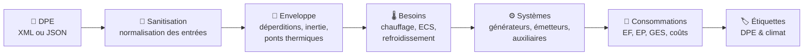
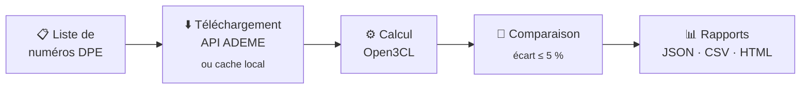
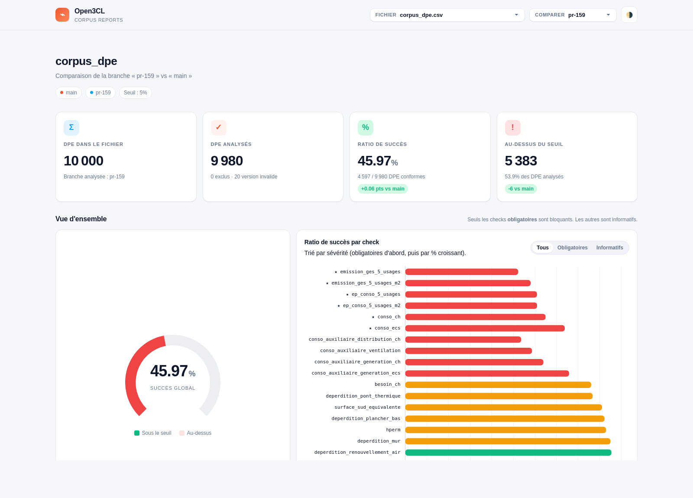
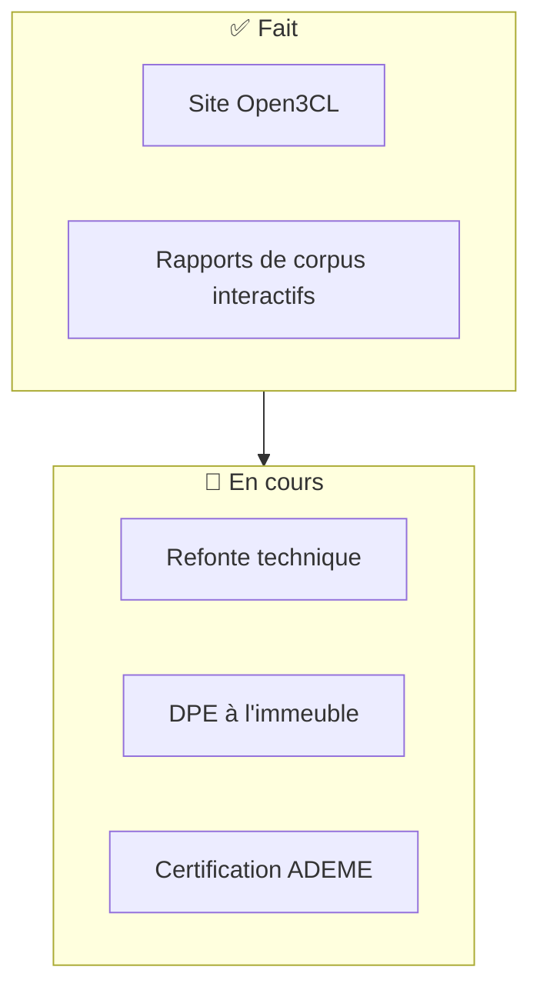

<a id="readme-top"></a>

[![Contributors][contributors-shield]][contributors-url]
[![Forks][forks-shield]][forks-url]
[![Stargazers][stars-shield]][stars-url]
[![Issues][issues-shield]][issues-url]
[![ GPL-3.0 license][license-shield]][license-url]

<br />
<div align="center">
  <a href="https://open3cl.fr">
    
  </a>

<h3 align="center">Open3CL</h3>
Implémentation open source du moteur Open3CL de l'ADEME.
  <p align="center">

![Javascript][Javascript]

   <br/>
<a href="https://github.com/Open3CL/engine/issues/new?labels=bug&template=bug-report---.md">Créer un bug</a>
    &middot;
    <a href="https://github.com/Open3CL/engine/issues/new?labels=enhancement&template=feature-request---.md">Créer une feature</a>
    &middot;
    <a href="https://open3cl.github.io/engine/build/">Démo en ligne</a>
    &middot;
    <a href="https://open3cl.github.io/engine/reports/corpus">Rapports de corpus</a>
  </p>
</div>

<div align="center">

**Donnez-lui un DPE au format XML ou JSON, il vous rend les consommations, les émissions et les étiquettes.**

</div>

<details>
  <summary>📚 Sommaire</summary>
  <ol>
    <li><a href="#-à-propos-du-projet">À propos du projet</a>
      <ul>
        <li><a href="#ce-que-fait-le-moteur">Ce que fait le moteur</a></li>
        <li><a href="#périmètre-couvert">Périmètre couvert</a></li>
        <li><a href="#lécosystème-open3cl">L'écosystème Open3CL</a></li>
      </ul>
    </li>
    <li><a href="#-démarrage">Démarrage</a>
      <ul>
        <li><a href="#pré-requis">Pré-requis</a></li>
        <li><a href="#installation">Installation</a></li>
        <li><a href="#en-30-secondes">En 30 secondes</a></li>
      </ul>
    </li>
    <li><a href="#-utilisation">Utilisation</a>
      <ul>
        <li><a href="#api-publique">API publique</a></li>
        <li><a href="#options-de-calcul">Options de calcul</a></li>
        <li><a href="#lire-le-résultat">Lire le résultat</a></li>
        <li><a href="#tester-un-dpe-sans-écrire-de-code">Tester un DPE sans écrire de code</a></li>
      </ul>
    </li>
    <li><a href="#-tests-de-corpus">Tests de corpus</a>
      <ul>
        <li><a href="#le-rapport-interactif">Le rapport interactif</a></li>
        <li><a href="#lancer-un-corpus">Lancer un corpus</a></li>
        <li><a href="#résultats-corpus">Résultats corpus</a></li>
      </ul>
    </li>
    <li><a href="#-roadmap">Roadmap</a></li>
    <li><a href="#-contribuer">Contribuer</a></li>
    <li><a href="#-licence">Licence</a></li>
    <li><a href="#-contact">Contact</a></li>
    <li><a href="#-remerciements">Remerciements</a></li>
  </ol>
</details>

---

## 🌍 À propos du projet

**Open3CL** est une librairie JavaScript open source qui calcule un **Diagnostic de Performance Énergétique (DPE)**.
Elle implémente la méthode **3CL-DPE 2021** définie dans
[l'annexe 1 de l'arrêté du 31 mars 2021](https://rt-re-batiment.developpement-durable.gouv.fr/IMG/pdf/consolide_annexe_1_arrete_du_31_03_2021_relatif_aux_methodes_et_procedures_applicables.pdf),
la même méthode que celle utilisée par les logiciels certifiés du marché.

Concrètement : vous lui fournissez les **données d'entrée** d'un DPE (l'enveloppe du bâtiment, les systèmes de
chauffage,
d'ECS, de ventilation, de climatisation) et elle recalcule **l'intégralité des sorties** — déperditions, besoins,
consommations, émissions de gaz à effet de serre, coûts et étiquettes.

|                         |                                                                                                            |
| :---------------------- | :--------------------------------------------------------------------------------------------------------- |
| 🎯 **Conforme**         | Implémente la méthode réglementaire 3CL-DPE 2021, article par article                                      |
| 🔍 **Vérifiable**       | ~90 000 DPE réels rejoués à chaque version, résultats publiés (voir [Résultats corpus](#résultats-corpus)) |
| 🧩 **Sans dépendance**  | Pure JavaScript (ESM), aucun service externe, fonctionne en Node.js comme dans un navigateur               |
| 📦 **Prête à intégrer** | Entrée XML ADEME ou objet JSON, sortie JSON complète                                                       |
| 🆓 **Libre**            | Licence GPL-3.0, développée au grand jour                                                                  |

### Ce que fait le moteur



<details>
<summary><strong>Le détail des étapes de calcul</strong></summary>

| Étape                 | Ce qui est calculé                                                                                    |
| :-------------------- | :---------------------------------------------------------------------------------------------------- |
| **Sanitisation**      | Normalisation et correction des données d'entrée incohérentes (optionnelle)                           |
| **Enveloppe**         | Déperditions des murs, planchers, baies, portes, ponts thermiques, renouvellement d'air, perméabilité |
| **Inertie & confort** | Classe d'inertie, confort d'été, qualité d'isolation                                                  |
| **Besoins**           | Besoins de chauffage et d'ECS mensuels, apports solaires et internes, besoin de refroidissement       |
| **Systèmes**          | Rendements de génération / distribution / émission / stockage, pertes, intermittence                  |
| **Auxiliaires**       | Consommations des auxiliaires de génération et de distribution (chauffage et ECS)                     |
| **Consommations**     | Énergie finale, énergie primaire, émissions de GES, coûts par usage et par énergie                    |
| **Étiquettes**        | Classe énergie et classe climat, y compris la projection avec le coefficient EP 1,7                   |

</details>

### Périmètre couvert

| Type de DPE                                   | Statut                       |
| :-------------------------------------------- | :--------------------------- |
| Maison individuelle                           | ✅ Supporté                  |
| Appartement (chauffage individuel)            | ✅ Supporté                  |
| Appartement (chauffage collectif ou mixte)    | ✅ Supporté                  |
| Immeuble collectif                            | ✅ Supporté                  |
| Appartement généré à partir d'un DPE immeuble | 🚧 En cours de fiabilisation |
| Photovoltaïque                                | 🚧 En cours                  |

> [!NOTE]
> Le moteur vise la **reproduction fidèle** des sorties des logiciels certifiés, y compris certains de leurs écarts à la
> méthode.

### L'écosystème Open3CL

| Ressource                                                             | Description                                                    |
| :-------------------------------------------------------------------- | :------------------------------------------------------------- |
| [open3cl.fr](https://open3cl.fr)                                      | Le site du projet                                              |
| [Démonstrateur](https://open3cl.github.io/engine/build/)              | Chargez un DPE XML et comparez les sorties du moteur, en ligne |
| [Rapports de corpus](https://open3cl.github.io/engine/reports/corpus) | Le tableau de bord interactif des résultats sur DPE réels      |
| [@open3cl/engine](https://www.npmjs.com/package/@open3cl/engine)      | Le paquet npm                                                  |

<p align="right">(<a href="#readme-top">Retour sommaire</a>)</p>

---

## 🚀 Démarrage

### Pré-requis

| Outil       | Version   |
| :---------- | :-------- |
| **Node.js** | ≥ 24.14.1 |
| **npm**     | ≥ 11.11.0 |

La version exacte utilisée en développement et en CI est fixée dans [`.nvmrc`](.nvmrc) (`nvm use`).

### Installation

```sh
npm install @open3cl/engine
```

<details>
<summary>Avec un autre gestionnaire de paquets</summary>

```sh
yarn add @open3cl/engine
pnpm add @open3cl/engine
```

</details>

### En 30 secondes

```javascript
import { calcul_3cl_xml } from '@open3cl/engine';
import { readFileSync } from 'node:fs';

const dpe = calcul_3cl_xml(readFileSync('./mon-dpe.xml', 'utf8'));

const { ep_conso, emission_ges } = dpe.logement.sortie;

console.log(`Étiquette énergie : ${ep_conso.classe_bilan_dpe}`);
console.log(`Consommation      : ${ep_conso.ep_conso_5_usages_m2} kWh/m²/an`);
console.log(`Étiquette climat  : ${emission_ges.classe_emission_ges}`);
console.log(`Émissions         : ${emission_ges.emission_ges_5_usages_m2} kgCO₂/m²/an`);
```

```text
Étiquette énergie : D
Consommation      : 174 kWh/m²/an
Étiquette climat  : C
Émissions         : 30 kgCO₂/m²/an
```

> [!TIP]
> Les fichiers XML de n'importe quel DPE publié sont téléchargeables depuis
> [l'observatoire de l'ADEME](https://observatoire-dpe-audit.ademe.fr/). C'est le moyen le plus simple de tester le
> moteur sur un cas réel.

<p align="right">(<a href="#readme-top">Retour sommaire</a>)</p>

---

## 🛠️ Utilisation

### API publique

| Fonction                        | Entrée      | Description                                                |
| :------------------------------ | :---------- | :--------------------------------------------------------- |
| `calcul_3cl(dpe, options?)`     | Objet JSON  | Calcule un DPE et renvoie l'objet enrichi de ses sorties   |
| `calcul_3cl_xml(xml, options?)` | Chaîne XML  | Parse le XML puis appelle `calcul_3cl`                     |
| `get_classe_ges_dpe(dpe)`       | DPE calculé | Recalcule les étiquettes énergie et climat                 |
| `get_conso_coeff_1_7_2027(dpe)` | DPE calculé | Projette la consommation avec le coefficient EP 1,7 (2027) |
| `getVersion()`                  | –           | Version du moteur utilisée                                 |

### Options de calcul

```javascript
import { calcul_3cl, calcul_3cl_xml } from '@open3cl/engine';

// Depuis un objet JSON — sanitisation activée par défaut
const a = calcul_3cl(dpeData);
const b = calcul_3cl(dpeData, { sanitize: true }); // équivalent

// Sans pré-transformation : les données d'entrée sont utilisées telles quelles
const c = calcul_3cl(dpeData, { sanitize: false });

// Depuis un XML ADEME
const d = calcul_3cl_xml(xmlString);
const e = calcul_3cl_xml(xmlString, { sanitize: false });
```

| Option     | Défaut | Effet                                                                                                  |
| :--------- | :----- | :----------------------------------------------------------------------------------------------------- |
| `sanitize` | `true` | Normalise et corrige les incohérences du DPE d'entrée avant calcul. Désactivez-le pour un calcul brut. |

<details>
<summary><strong>Exemple d'objet JSON d'entrée (partiel)</strong></summary>

```javascript
const dpeData = {
  numero_dpe: '2113E1018248X',
  statut: 'ACTIF',
  logement: {
    caracteristique_generale: {
      annee_construction: 1948,
      surface_habitable_logement: 49.96
    },
    installation_chauffage_collection: {
      installation_chauffage: [
        {
          description: 'Chaudière individuelle gaz standard',
          surface_chauffee: 49.96,
          generateur_chauffage_collection: {
            generateur_chauffage: [{ description: '...' }]
          }
        }
      ]
    }
  }
};
```

La structure attendue est celle du **XML DPE de l'ADEME**, converti en JSON. Les types complets sont décrits dans
[`types.d.ts`](types.d.ts).

</details>

### Lire le résultat

Le DPE renvoyé est l'objet d'entrée, enrichi de `logement.sortie` :

| Chemin                                     | Contenu                                                |
| :----------------------------------------- | :----------------------------------------------------- |
| `sortie.deperdition`                       | Déperditions par paroi et déperdition d'enveloppe (GV) |
| `sortie.apport_et_besoin`                  | Besoins de chauffage et d'ECS, apports, `nadeq`        |
| `sortie.ef_conso`                          | Consommations en énergie finale, par usage             |
| `sortie.ep_conso`                          | Énergie primaire, `classe_bilan_dpe`, projection 2027  |
| `sortie.emission_ges`                      | Émissions de GES et `classe_emission_ges`              |
| `sortie.cout`                              | Coûts annuels par usage                                |
| `sortie.confort_ete` / `qualite_isolation` | Indicateurs de confort d'été et de qualité d'isolation |
| `sortie.production_electricite`            | Production photovoltaïque                              |

### Tester un DPE sans écrire de code

Le [démonstrateur en ligne](https://open3cl.github.io/engine/build/) accepte un DPE au format XML, l'envoie au moteur et
affiche **côte à côte** les valeurs du DPE d'origine, celles calculées par Open3CL, et le différentiel.

C'est le moyen le plus rapide de qualifier un écart : problème dans le DPE d'origine, ou bug dans la librairie ?

<p align="right">(<a href="#readme-top">Retour sommaire</a>)</p>

---

## 🧪 Tests de corpus

> Un corpus, c'est une liste de numéros de DPE réels. Le moteur les rejoue **tous**, compare ses sorties à celles du
> DPE publié, et en tire un taux de conformité. C'est le principal indicateur de qualité du projet.



**22 grandeurs** sont comparées pour chaque DPE. Quatre d'entre elles sont **bloquantes** : un DPE n'est déclaré
conforme
que si **toutes** restent sous le seuil de tolérance de **5 %**.

| Contrôle bloquant                                      | Ce que c'est                        |
| :----------------------------------------------------- | :---------------------------------- |
| `sortie.ef_conso.conso_ecs`                            | Consommation d'eau chaude sanitaire |
| `sortie.ef_conso.conso_ch`                             | Consommation de chauffage           |
| `sortie.ep_conso.ep_conso_5_usages` (ou `_m2`)         | Consommation en énergie primaire    |
| `sortie.emission_ges.emission_ges_5_usages` (ou `_m2`) | Émissions de gaz à effet de serre   |

📖 **Guide complet** : [docs/CORPUS.md](docs/CORPUS.md) — liste des corpus, contrôles informatifs, variables
d'environnement, quotas de l'API ADEME, structure des rapports.

### Le rapport interactif

Chaque exécution produit un tableau de bord HTML : jauge de réussite, ratio par contrôle, liste des DPE au-dessus du
seuil avec le **détail des propriétés en écart**, et comparaison entre deux branches.

<div align="center">
  <a href="https://open3cl.github.io/engine/reports/corpus">
    
  </a>
  <br/>
  <sub>👉 <a href="https://open3cl.github.io/engine/reports/corpus"><strong>Ouvrir le rapport interactif</strong></a></sub>
</div>

> [!NOTE]
> GitHub neutralise les scripts et les `iframe` dans les fichiers markdown : le rapport ne peut donc pas être
> **intégré**
> tel quel dans ce README. Il est affiché ici sous forme d'aperçu cliquable, et reste consultable en ligne ou en local :
>
> ```sh
> npm run reports:preview   # sert dist/reports/corpus et ouvre le navigateur
> ```

### Lancer un corpus

```sh
# Tous les corpus, puis mise à jour automatique des résultats dans ce README
npm run test:corpus:all

# Un seul corpus
npm run test:corpus

# Un corpus précis
npm run test:corpus -- corpus-file-path=corpus.csv

# Un seul DPE, pour investiguer
npm run test:corpus -- dpes-code=2592E1233185X
```

| Argument                  | Description                                                                |
| :------------------------ | :------------------------------------------------------------------------- |
| `corpus-file-path=<path>` | Fichier de corpus à analyser (défaut : `test/corpus/files/corpus_dpe.csv`) |
| `dpes-folder-path=<path>` | Dossier de cache des DPE. Un DPE déjà présent n'est pas retéléchargé       |
| `dpes-code=<code>`        | Ne rejoue qu'un seul DPE                                                   |

> [!TIP]
> Définissez `DPE_FOLDER_PATH` une fois pour toutes plutôt que de répéter `dpes-folder-path`. Les DPE absents du cache
> sont téléchargés depuis l'API de l'ADEME — pensez aux [quotas](docs/CORPUS.md#quotas-de-lapi-ademe).

### Résultats corpus

Ces résultats sont **générés automatiquement** à la fin de `npm run test:corpus:all` par
[`scripts/generate_corpus_readme.js`](scripts/generate_corpus_readme.js). Ne les modifiez pas à la main.

<!-- CORPUS:START -->

> **Version `1.6.2`** · branche `main` · généré le 2026-09-18
> Seuil de tolérance **5%**

<table>
<tr>
<td align="center"><strong>9</strong><br/><sub>corpus</sub></td>
<td align="center"><strong>89 996</strong><br/><sub>DPE analysés</sub></td>
<td align="center"><strong>59 497</strong><br/><sub>DPE conformes</sub></td>
<td align="center"><strong>66,11 %</strong><br/><sub>réussite globale</sub></td>
</tr>
</table>

|     | Corpus                                                                                                                  |    Réussite |                        |  DPE conformes |
| :-: | :---------------------------------------------------------------------------------------------------------------------- | ----------: | :--------------------- | -------------: |
| 🔴  | **Généraliste**<br/><sub>`corpus_dpe.csv`</sub>                                                                         | **45,97 %** | `█████████░░░░░░░░░░░` | 4 597 / 10 000 |
| 🟢  | **Appartement · chauffage individuel (2025)**<br/><sub>`dpe_appartement_individuel_chauffage_individuel_2025.csv`</sub> | **91,55 %** | `██████████████████░░` | 9 155 / 10 000 |
| 🟢  | **Logement individuel (2025)**<br/><sub>`dpe_logement_individuel_2025.csv`</sub>                                        | **88,14 %** | `██████████████████░░` |  8 812 / 9 998 |
| 🟢  | **Maison individuelle (2025)**<br/><sub>`dpe_maison_individuelle_2025.csv`</sub>                                        | **87,93 %** | `██████████████████░░` | 8 793 / 10 000 |
| 🟡  | **Immeuble · chauffage individuel**<br/><sub>`dpe_immeuble_chauffage_individuel.csv`</sub>                              | **73,76 %** | `███████████████░░░░░` |  7 375 / 9 999 |
| 🟡  | **Appartement · chauffage collectif (2025)**<br/><sub>`dpe_appartement_individuel_chauffage_collectif_2025.csv`</sub>   | **69,47 %** | `██████████████░░░░░░` | 6 947 / 10 000 |
| 🟡  | **Immeuble · chauffage collectif**<br/><sub>`dpe_immeuble_chauffage_collectif.csv`</sub>                                | **62,27 %** | `████████████░░░░░░░░` |  6 226 / 9 999 |
| 🔴  | **Immeuble · chauffage mixte**<br/><sub>`dpe_immeuble_chauffage_mixte.csv`</sub>                                        | **48,37 %** | `██████████░░░░░░░░░░` | 4 837 / 10 000 |
| 🔴  | **Individuel généré depuis l'immeuble (2026)**<br/><sub>`dpe_individuel_a_partir_dpe_immeuble_2026.csv`</sub>           | **27,55 %** | `██████░░░░░░░░░░░░░░` | 2 755 / 10 000 |

<sub>🟢 ≥ 85 % · 🟡 ≥ 60 % · 🔴 < 60 %</sub>

#### Temps d’exécution

> Durée de l’appel à `calcul_3cl` par DPE, sur 89 956 calculs.
> La copie défensive de l’entrée et la lecture du fichier sont exclues de la mesure.

<table>
<tr>
<td align="center"><strong>5,61 ms</strong><br/><sub>moyenne</sub></td>
<td align="center"><strong>5,03 ms</strong><br/><sub>médiane</sub></td>
<td align="center"><strong>0,11 ms</strong><br/><sub>min</sub></td>
<td align="center"><strong>705,8 ms</strong><br/><sub>max</sub></td>
</tr>
</table>

| Corpus                                         | Moyenne | Médiane |     Min |      Max |     p95 |     p99 |
| :--------------------------------------------- | ------: | ------: | ------: | -------: | ------: | ------: |
| **Généraliste**                                | 4,50 ms | 4,09 ms | 0,20 ms |  34,8 ms | 8,12 ms | 11,3 ms |
| **Appartement · chauffage individuel (2025)**  | 3,71 ms | 3,46 ms | 1,32 ms |  26,1 ms | 6,22 ms | 7,99 ms |
| **Logement individuel (2025)**                 | 5,30 ms | 4,84 ms | 1,52 ms |  42,5 ms | 9,73 ms | 13,2 ms |
| **Maison individuelle (2025)**                 | 6,54 ms | 6,02 ms | 1,71 ms |  54,5 ms | 11,6 ms | 16,4 ms |
| **Immeuble · chauffage individuel**            | 7,17 ms | 6,22 ms | 0,11 ms | 137,7 ms | 14,3 ms | 22,3 ms |
| **Appartement · chauffage collectif (2025)**   | 3,98 ms | 3,76 ms | 1,22 ms |  37,6 ms | 6,35 ms | 8,00 ms |
| **Immeuble · chauffage collectif**             | 6,40 ms | 5,58 ms | 0,15 ms | 101,0 ms | 12,1 ms | 21,2 ms |
| **Immeuble · chauffage mixte**                 | 6,01 ms | 5,01 ms | 0,22 ms | 705,8 ms | 12,4 ms | 19,8 ms |
| **Individuel généré depuis l'immeuble (2026)** | 6,89 ms | 6,27 ms | 1,52 ms |  65,1 ms | 13,0 ms | 19,7 ms |

<sub>La moyenne est tirée vers le haut par les DPE collectifs, dont le coût atteint plusieurs
dizaines de fois la médiane : c’est la médiane qui décrit le cas courant, et p95/p99 le cas
défavorable réel.</sub>

<!-- CORPUS:END -->

📈 Historique complet des versions : [docs/CORPUS-HISTORY.md](docs/CORPUS-HISTORY.md)

<p align="right">(<a href="#readme-top">Retour sommaire</a>)</p>

---

## 🗺️ Roadmap



| Étape               | Statut      | Détail                                                           |
| :------------------ | :---------- | :--------------------------------------------------------------- |
| Site Open3CL        | ✅ Terminé  | [open3cl.fr](https://open3cl.fr)                                 |
| Rapports de tests   | ✅ Terminé  | Tableau de bord interactif publié à chaque exécution             |
| Refonte technique   | 🚧 En cours | Découpage par article de la méthode, couverture de tests à 100 % |
| DPE à l'immeuble    | 🚧 En cours | Fiabilisation des appartements générés depuis un DPE immeuble    |
| Certification ADEME | 🚧 En cours | Objectif de long terme                                           |

Le détail complet des bugs et fonctionnalités en cours est dans les
[issues](https://github.com/Open3CL/engine/issues).

<p align="right">(<a href="#readme-top">Retour sommaire</a>)</p>

---

## 🤝 Contribuer

Toutes les contributions sont les bienvenues : correction d'un écart de calcul, ajout de tests, documentation, ou
simplement le signalement d'un DPE qui ne passe pas.

```sh
git clone https://github.com/Open3CL/engine.git
cd engine
npm ci
npm run test:unit     # tests unitaires
npm run qa:lint       # analyse statique
npm run qa:format     # formatage
```

| Vous voulez…                   | Allez voir                                                                                                           |
| :----------------------------- | :------------------------------------------------------------------------------------------------------------------- |
| Signaler un bug                | [Ouvrir un bug](https://github.com/Open3CL/engine/issues/new?labels=bug&template=bug-report---.md)                   |
| Proposer une fonctionnalité    | [Ouvrir une feature](https://github.com/Open3CL/engine/issues/new?labels=enhancement&template=feature-request---.md) |
| Soumettre du code              | [CONTRIBUTING.md](CONTRIBUTING.md)                                                                                   |
| Comprendre les tests de corpus | [docs/CORPUS.md](docs/CORPUS.md)                                                                                     |

📖 Le guide de contribution détaillé — conventions de commit, règles de code, cycle d'une pull request, méthode de
debug d'un écart de calcul — est dans **[CONTRIBUTING.fr.md](CONTRIBUTING.fr.md)**.

<p align="right">(<a href="#readme-top">Retour sommaire</a>)</p>

---

## 📄 Licence

Distribué sous licence **GPL-3.0**. Voir le fichier [`LICENSE`](LICENSE) pour plus d'informations.

<p align="right">(<a href="#readme-top">Retour sommaire</a>)</p>

---

## 📬 Contact

Pour toute question : **open3cl@redfroggy.fr**

<p align="right">(<a href="#readme-top">Retour sommaire</a>)</p>

---

## 🙏 Remerciements

### Les contributeurs

Merci à toutes les personnes qui ont écrit, testé, relu ou corrigé une ligne de ce moteur.

<a href="https://github.com/Open3CL/engine/graphs/contributors">
  
</a>

### Les organisations qui soutiennent le projet

<table>
  <tr>
    <td align="center" width="33%">
      <a href="https://redfroggy.fr/"><strong>RedFroggy</strong></a>
      <br/><br/>
      <sub>À l'initiative du projet et de sa maintenance. Studio de développement web et mobile.</sub>
    </td>
    <td align="center" width="33%">
      <a href="https://kardino.fr"><strong>Kardino</strong></a>
      <br/><br/>
      <sub>Accompagnement à la rénovation énergétique des logements.</sub>
    </td>
    <td align="center" width="33%">
      <a href="https://checkdpe.fr/"><strong>Check DPE</strong></a>
      <br/><br/>
      <sub>Vérification et analyse de DPE en ligne.</sub>
    </td>
  </tr>
</table>

### Les ressources

- L'[ADEME](https://www.ademe.fr/) pour la publication de la méthode 3CL-DPE 2021 et l'ouverture des données DPE
- L'[observatoire DPE-Audit](https://observatoire-dpe-audit.ademe.fr/) qui rend possible les tests de corpus

<p align="right">(<a href="#readme-top">Retour sommaire</a>)</p>

[contributors-shield]: https://img.shields.io/github/contributors/Open3CL/engine.svg?style=for-the-badge
[contributors-url]: https://github.com/Open3CL/engine/graphs/contributors
[forks-shield]: https://img.shields.io/github/forks/Open3CL/engine.svg?style=for-the-badge
[forks-url]: https://github.com/Open3CL/network/members
[stars-shield]: https://img.shields.io/github/stars/Open3CL/engine.svg?style=for-the-badge
[stars-url]: https://github.com/Open3CL/stargazers
[issues-shield]: https://img.shields.io/github/issues/Open3CL/engine.svg?style=for-the-badge
[issues-url]: https://github.com/Open3CL/issues
[license-shield]: https://img.shields.io/github/license/Open3CL/engine.svg?style=for-the-badge
[license-url]: https://github.com/Open3CL/blob/master/LICENSE
[product-screenshot]: images/screenshot.png
[Javascript]: https://img.shields.io/badge/javascript-000000?style=for-the-badge&logo=javascript&logoColor=white
