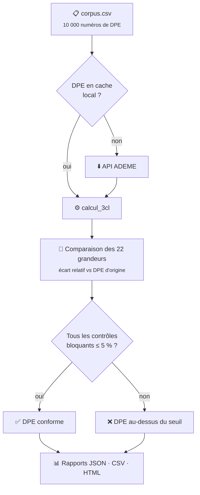

# 🧪 Guide des tests de corpus

> Retour au [README](../README.md)

Un **corpus** est une liste de numéros de DPE réels, publiés par l'ADEME. Les tests de corpus rejouent ces DPE dans le
moteur Open3CL et comparent les sorties calculées à celles du DPE d'origine. C'est le principal indicateur de qualité du
projet : il mesure, sur des dizaines de milliers de cas réels, l'écart entre Open3CL et les logiciels certifiés.

---

## Sommaire

- [Principe](#principe)
- [Ce qui est contrôlé](#ce-qui-est-contrôlé)
- [Les corpus disponibles](#les-corpus-disponibles)
- [Lancer un corpus](#lancer-un-corpus)
- [Variables d'environnement](#variables-denvironnement)
- [Quotas de l'API ADEME](#quotas-de-lapi-ademe)
- [Les rapports produits](#les-rapports-produits)
- [Le rapport interactif](#le-rapport-interactif)
- [Mise à jour automatique du README](#mise-à-jour-automatique-du-readme)
- [Investiguer un écart](#investiguer-un-écart)

---

## Principe



Le calcul est réparti sur plusieurs **worker threads** (voir `MAX_WORKER_THREADS`), avec une barre de progression pour
le téléchargement et une pour l'analyse.

Le **seuil de tolérance est de 5 %** par défaut. Un DPE n'est compté comme conforme que si **tous** les contrôles
bloquants restent sous ce seuil.

---

## Ce qui est contrôlé

### Contrôles bloquants

Ce sont eux qui déterminent la conformité d'un DPE.

| Propriété                                                       | Grandeur                                  |
| :-------------------------------------------------------------- | :---------------------------------------- |
| `logement.sortie.ef_conso.conso_ecs`                            | Consommation d'eau chaude sanitaire (EF)  |
| `logement.sortie.ef_conso.conso_ch`                             | Consommation de chauffage (EF)            |
| `logement.sortie.ep_conso.ep_conso_5_usages` (ou `_m2`)         | Consommation 5 usages en énergie primaire |
| `logement.sortie.emission_ges.emission_ges_5_usages` (ou `_m2`) | Émissions de gaz à effet de serre         |

### Contrôles informatifs

Ils ne bloquent pas, mais permettent de localiser l'origine d'un écart : si `conso_ch` dérive, c'est souvent
`besoin_ch`, lui-même souvent une déperdition, qui est en cause.

| Famille               | Propriétés contrôlées                                                                                                                                                                               |
| :-------------------- | :-------------------------------------------------------------------------------------------------------------------------------------------------------------------------------------------------- |
| **Enveloppe**         | `deperdition_mur`, `deperdition_baie_vitree`, `deperdition_plancher_bas`, `deperdition_plancher_haut`, `deperdition_porte`, `deperdition_pont_thermique`, `deperdition_renouvellement_air`, `hperm` |
| **Apports & besoins** | `surface_sud_equivalente`, `besoin_ecs`, `besoin_ch`                                                                                                                                                |
| **Auxiliaires**       | `conso_auxiliaire_distribution_ch`, `conso_auxiliaire_distribution_ecs`, `conso_auxiliaire_generation_ch`, `conso_auxiliaire_generation_ecs`, `conso_auxiliaire_ventilation`                        |

> [!TIP]
> Pour remonter à la cause d'un écart, lisez les contrôles **de haut en bas** de la chaîne de calcul : une déperdition
> fausse fait dériver le besoin, qui fait dériver la consommation, qui fait dériver l'étiquette.

---

## Les corpus disponibles

Neuf corpus, **10 000 DPE chacun**, situés dans [`test/corpus/files`](../test/corpus/files).

| Fichier                                                    | Contenu                                               |
| :--------------------------------------------------------- | :---------------------------------------------------- |
| `corpus_dpe.csv`                                           | Corpus généraliste, tous types de DPE confondus       |
| `dpe_logement_individuel_2025.csv`                         | DPE de logements individuels réalisés en 2025         |
| `dpe_maison_individuelle_2025.csv`                         | DPE de maisons individuelles réalisés en 2025         |
| `dpe_appartement_individuel_chauffage_individuel_2025.csv` | Appartements avec chauffage individuel, 2025          |
| `dpe_appartement_individuel_chauffage_collectif_2025.csv`  | Appartements avec chauffage collectif, 2025           |
| `dpe_immeuble_chauffage_individuel.csv`                    | DPE à l'immeuble, logements à chauffage individuel    |
| `dpe_immeuble_chauffage_collectif.csv`                     | DPE à l'immeuble, logements à chauffage collectif     |
| `dpe_immeuble_chauffage_mixte.csv`                         | DPE à l'immeuble, logements à chauffage mixte         |
| `dpe_individuel_a_partir_dpe_immeuble_2026.csv`            | Appartements générés à partir d'un DPE immeuble, 2026 |

---

## Lancer un corpus

```sh
# Tous les corpus + mise à jour automatique des résultats dans le README
npm run test:corpus:all

# Le corpus par défaut (test/corpus/files/corpus_dpe.csv)
npm run test:corpus

# Un corpus précis
npm run test:corpus -- corpus-file-path=corpus.csv

# Un dossier de cache des DPE
npm run test:corpus -- dpes-folder-path=/home/user/dpes

# Un seul DPE, pour investiguer
npm run test:corpus -- dpes-code=2592E1233185X

# Tous les corpus + alimentation de la base de résultats
npm run test:corpus:all+database
```

| Argument                  | Description                                                                                                    |
| :------------------------ | :------------------------------------------------------------------------------------------------------------- |
| `corpus-file-path=<path>` | Chemin relatif du fichier de corpus. Défaut : `test/corpus/files/corpus_dpe.csv`                               |
| `dpes-folder-path=<path>` | Dossier de cache des DPE. Un DPE déjà présent n'est pas retéléchargé. Peut être remplacé par `DPE_FOLDER_PATH` |
| `dpes-code=<code>`        | N'exécute qu'un seul DPE, identifié par son numéro                                                             |
| `no-dpe-pos=<n>`          | Position de la colonne du numéro de DPE dans le CSV d'entrée (défaut : 0)                                      |

---

## Variables d'environnement

| Nom                       | Description                                                                                         |
| :------------------------ | :-------------------------------------------------------------------------------------------------- |
| `DPE_FOLDER_PATH`         | **Obligatoire** — dossier de stockage des fichiers DPE (ou `dpes-folder-path` en ligne de commande) |
| `ADEME_API_CLIENT_ID`     | Client id de l'API ADEME                                                                            |
| `ADEME_API_CLIENT_SECRET` | Client secret de l'API ADEME                                                                        |
| `MAX_WORKER_THREADS`      | Nombre maximum de threads. Défaut : `os.availableParallelism * 1.5`                                 |
| `WORKER_THREADS_CHUNKS`   | Nombre de DPE analysés par thread. Défaut : `200`                                                   |
| `DOWNLOAD_DPE_WAIT`       | Temps d'attente entre deux téléchargements, en ms. Défaut : `1000`                                  |
| `SCW_ACCESS_KEY`          | Client id de l'API Scaleway                                                                         |
| `SCW_SECRET_KEY`          | Client secret de l'API Scaleway                                                                     |
| `S3_REGION`               | Région du bucket S3 de stockage des DPE                                                             |
| `S3_ENDPOINT`             | Endpoint du bucket S3 de stockage des DPE                                                           |

---

## Quotas de l'API ADEME

| Fenêtre     | Limite          |
| :---------- | :-------------- |
| Par seconde | 100 requêtes    |
| Par minute  | 1 000 requêtes  |
| Par jour    | 10 000 requêtes |

Lorsqu'un corpus doit télécharger beaucoup de DPE absents du cache local, la configuration la plus stable est :

```sh
export MAX_WORKER_THREADS=10
export API_ADEME_DOWNLOAD_WAIT=1000
export WORKER_THREADS_CHUNKS=300
```

---

## Les rapports produits

Tout est écrit dans `dist/reports/corpus/<corpus>.csv/`, suffixé par la **branche git courante** — ce qui permet de
comparer deux branches dans le rapport interactif.

| Fichier                                                    | Contenu                                                                     |
| :--------------------------------------------------------- | :-------------------------------------------------------------------------- |
| `corpus_global_report_<branche>.json`                      | Synthèse : nombre de DPE, ratio de réussite, détail par contrôle            |
| `corpus_detailed_report_<branche>.csv`                     | Une ligne par DPE, avec pour chaque grandeur `_input`, `_output` et `_diff` |
| `corpus_dpe_list_above_threshold_<branche>.json`           | Liste des DPE au-dessus du seuil                                            |
| `corpus_dpe_list_above_threshold_diff_main_<branche>.json` | DPE au-dessus du seuil sur cette branche mais **pas** sur `main`            |
| `../corpus_list_main.json`                                 | Index des corpus et des branches, consommé par le rapport HTML              |

<details>
<summary><strong>Structure du rapport global</strong></summary>

```json
{
  "threshold": "5%",
  "totalDpesInFile": 10000,
  "nbValidDpe": 9980,
  "nbInvalidDpeVersion": 20,
  "nbExcludedDpe": 0,
  "nbAllChecksBelowThreshold": 4591,
  "successRatio": "45.91 %",
  "dpeRunFailed": ["2262E0721086N"],
  "checks": {
    "conso_ch": { "nbBelowThreshold": 6486, "mandatory": true, "successRatio": "64.86 %" }
  }
}
```

</details>

---

## Le rapport interactif

```sh
npm run reports:preview
```

Ouvre `dist/reports/corpus/index.html` dans le navigateur. Le tableau de bord affiche :

- les **indicateurs clés** : DPE analysés, ratio de réussite, nombre de DPE au-dessus du seuil ;
- le **ratio par contrôle**, trié par sévérité, avec distinction des contrôles bloquants ;
- la **liste des DPE au-dessus du seuil**, avec au survol le **détail des propriétés en écart** (valeur attendue, valeur
  calculée, écart en %) ;
- la **comparaison entre deux branches** : DPE nouvellement en échec (`NEW`), corrigés (`FIX`), ou communs.

Le rapport est également publié à chaque build : **<https://open3cl.github.io/engine/reports/corpus>**.

<div align="center">
  
</div>

---

## Mise à jour automatique du README

`npm run test:corpus:all` enchaîne automatiquement sur :

```sh
npm run reports:readme
```

Ce script ([`scripts/generate_corpus_readme.js`](../scripts/generate_corpus_readme.js)) :

1. lit les rapports globaux de la branche courante ;
2. regénère le bloc situé entre `<!-- CORPUS:START -->` et `<!-- CORPUS:END -->` dans le README ;
3. reconstruit [`docs/CORPUS-HISTORY.md`](CORPUS-HISTORY.md) **à partir des tags git** : pour chaque
   tag `vX.Y.Z`, il relit les rapports globaux que la release embarque
   (`corpus_global_report_main.json`), ce qui donne une entrée par release et une seule. Les cinq
   dernières releases sont détaillées, les sections rédigées à la main sont conservées ;
4. met à jour [`docs/corpus-history.json`](corpus-history.json) et sa copie
   `dist/reports/corpus/corpus_history.json`, lue par la section « Historique des versions » du
   rapport interactif : une courbe par corpus, un point par release, bascule nombre / taux, survol
   pour comparer les corpus d'une version, légende cliquable pour en masquer.

> [!IMPORTANT]
> L'historique n'est pas alimenté par l'exécution courante : l'arbre de travail est en avance sur le
> dernier tag, et ses résultats seraient étiquetés avec le numéro de la release précédente. Une
> release n'apparaît donc qu'une fois son tag posé et récupéré (`git fetch --tags`).

Le bloc du README décrit l'exécution courante, sur n'importe quelle branche, ce qui permet de
comparer une PR à `main`. L'historique, lui, ne dépend que des tags : il se recalcule à l'identique.

| Option                | Description                                                |
| :-------------------- | :--------------------------------------------------------- |
| `--readme=<path>`     | Fichier markdown à mettre à jour. Défaut : `README.md`     |
| `--branch=<name>`     | Branche des rapports à lire. Défaut : branche git courante |
| `--version=<x.y.z>`   | Version affichée dans le README. Défaut : dernier tag git  |
| `--date=<aaaa-mm-jj>` | Date affichée dans le README. Défaut : aujourd'hui         |
| `--dry-run`           | Affiche le bloc généré sans rien écrire                    |
| `--no-history`        | N'alimente ni `CORPUS-HISTORY.md`, ni la courbe            |

---

## Investiguer un écart

1. **Isoler le DPE** dans le rapport interactif, ou directement dans le CSV détaillé :

   ```sh
   grep "^2263E1261479X," dist/reports/corpus/corpus_dpe.csv/corpus_detailed_report_main.csv
   ```

2. **Le rejouer seul**, avec les logs :

   ```sh
   npm run test:corpus -- dpes-code=2263E1261479X
   ```

3. **Remonter la chaîne** : la colonne `_diff` du CSV donne l'écart de chaque grandeur. Le premier écart dans l'ordre
   enveloppe → besoins → systèmes → consommations est presque toujours la cause des suivants.

4. **Figer le cas** en ajoutant un test dans `test/` à partir du DPE téléchargé dans `test/fixtures/`.

> Retour au [README](../README.md) · Guide de contribution : [CONTRIBUTING.fr.md](../CONTRIBUTING.fr.md)
